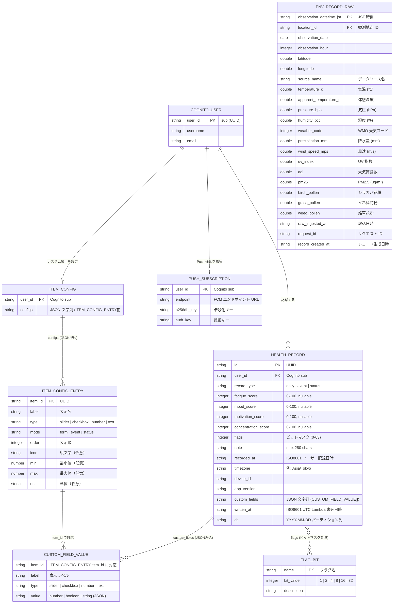
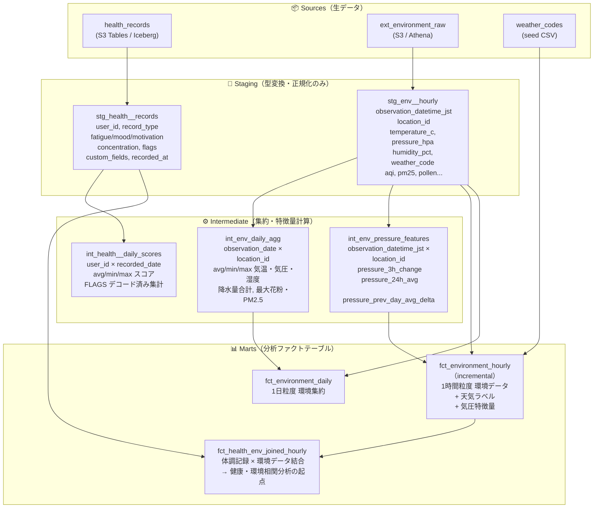

# ER 図 — Health Logger データモデル

> 対象: S3 Tables (Iceberg) / DynamoDB / dbt 分析レイヤー全体
> 更新: 2026-03-22

---

## 1. コアデータモデル（ストレージ層）



---

## 2. FLAGS ビットマスク詳細

`HEALTH_RECORD.flags` は整数値 1 つにライフスタイルフラグを詰め込んだビットマスク。

| フラグ名 | ビット値 | チェック式 |
|---------|---------|-----------|
| `poor_sleep` — 睡眠不足 | 1 (2⁰) | `flags & 1 != 0` |
| `headache` — 頭痛 | 2 (2¹) | `flags & 2 != 0` |
| `stomachache` — 腹痛 | 4 (2²) | `flags & 4 != 0` |
| `exercise` — 運動 | 8 (2³) | `flags & 8 != 0` |
| `alcohol` — 飲酒 | 16 (2⁴) | `flags & 16 != 0` |
| `caffeine` — カフェイン | 32 (2⁵) | `flags & 32 != 0` |

> 最大値: 63（全フラグ ON）

---

## 3. dbt 分析レイヤー（データリネージ）



---

## 4. record_type 別のカラム利用パターン

`HEALTH_RECORD.record_type` によって意味が変わる。

| カラム | `daily` | `event` | `status` |
|-------|---------|---------|---------|
| `fatigue_score` | ✅ 使用 | — | — |
| `mood_score` | ✅ 使用 | — | — |
| `motivation_score` | ✅ 使用 | — | — |
| `concentration_score` | ✅ 使用 | — | — |
| `flags` | ✅ 使用 | `0` 固定 | `0` 固定 |
| `note` | ✅ 使用 | — | — |
| `custom_fields` | フォーム項目 | イベント内容 | 状態 ON/OFF |

**`custom_fields` の典型例（record_type 別）**

```
daily:  [{"item_id":"sleep_hours","label":"睡眠時間","type":"number","value":7.5}]
event:  [{"item_id":"exercise","label":"運動","type":"checkbox","value":true}]
status: [{"item_id":"working","label":"勤務中","type":"checkbox","value":true}]
```

---

## 5. テーブル / ストレージ対応一覧

| エンティティ | ストレージ | 備考 |
|------------|---------|------|
| `HEALTH_RECORD` | S3 Tables (Apache Iceberg) | Firehose 経由で書き込み。Athena + Glue でクエリ |
| `ITEM_CONFIG` | DynamoDB `health-logger-prod-item-configs` | PK: `user_id`。全設定を 1 アイテムに保存 |
| `PUSH_SUBSCRIPTION` | DynamoDB `health-logger-prod-push-subscriptions` | PK: `user_id`。送信失敗時に自動削除 |
| `ENV_RECORD_RAW` | S3 + Athena (`ext_environment_raw`) | Open-Meteo API から Lambda で取込 |
| `weather_codes` | dbt seed CSV | WMO コード → 天気ラベルのマスタ |
| `COGNITO_USER` | Amazon Cognito User Pool | JWTの `sub` が各テーブルの `user_id` |
